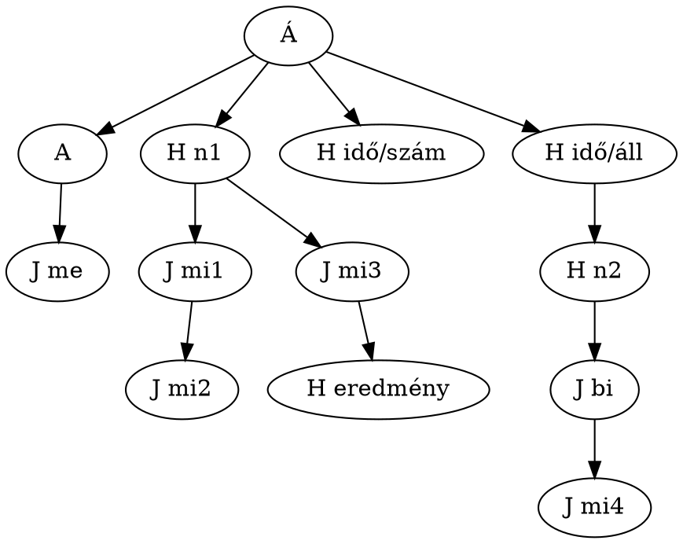

- ![[Drawing 2025-11-13 12.34.17.excalidraw|600]]

```dot
digraph G {
  "Á" -> "A";
  "Á" -> "H n1";
  "Á" -> "H idő/szám";
  "Á" -> "H idő/áll";
  "A" -> "J me";
  "H n1" -> "J mi1";
  "J mi1" -> "J mi2";
  "H n1" -> "J mi3";
  "J mi3" -> "H eredmény";
  "H idő/áll" -> "H n2";
  "H n2" -> "J bi";
  "J bi" -> "J mi4";
}
```
