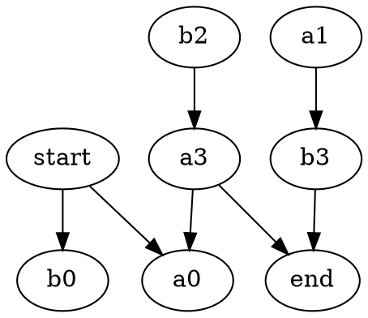

# Lovagi eszmény és udvari-lovagi kultúra

## A lovagság kialakulása

- A lovagság a **nyugat-európai hadseregek legütőképesebb rétegéből** alakult ki.
- A kengyel, a nyereg és a páncél megjelenése tette lehetővé a nehézfegyverzetű lovas harcosok, vagyis a lovagok létrejöttét.
- Csak **vagyonosabb földbirtokosok** engedhették meg maguknak a teljes felszerelést.
- A lovagok kezdetben katonák voltak, később a **lovagi életforma** és **erkölcsi eszmény** is kialakult.

## A lovag szerepe és helyzete

- A 11. századra a lovag **társadalmi réteggé** vált, melynek **saját erkölcsi kódexe** volt.
- Minden nemes ifjú **lovaggá avatási szertartáson** ment keresztül.
- A lovag köteles volt **védelmezni a gyengéket**, az **egyháziakat** és a **szegényeket**.
- Az udvari életben fontos szerepet játszott az **udvariasság** és a **hűség a hölgyhöz** – ez volt az **udvari szerelem** eszménye.

## A lovagi kultúra eszménye

- A lovagi kultúra fő értékei: **bátorság**, **becsület**, **hűség**, **kegyelet**.
- Az egyház igyekezett a lovagokat a **vallásos erkölcsök** felé terelni.
- A **lovagi tornák** a harci gyakorlat és a szórakozás eszközei voltak.
- A **lovagi költészet** és a **trubadúrok** megénekelték a hősi tetteket és a szerelmet.
---

## A lovag 12 kötelessége (Ramseni Lullus nyomán)

1. Az egyház tanainak megtartása
2. Az egyház védelme
3. Az ártatlanok védelme
4. A gyengék segítése
5. Harc a hit ellenségei ellen
6. Hűség az urához
7. Becsület megőrzése
8. Bátorság a harcban
9. Mértékletesség az életben
10. Udvariasság a hölgyekkel szemben
11. Igazságosság gyakorlása
12. A lovagi eszmények hirdetése másoknak

---

## Kérdés 1: Milyen fontossági sorrend figyelhető meg a kötelességek felsorolásában?

A sorrendben **a vallási és erkölcsi kötelességek** állnak az első helyen (egyház tanai, védelme), ezt követik a **társadalmi és harci kötelességek** (gyengék védelme, hűség, harc), majd az **erkölcsi és személyes tulajdonságok** (becsület, mértékletesség, udvariasság).  
Ez mutatja, hogy a lovagi eszményben **az istenhit és az erkölcs** fontosabb volt, mint a puszta harci erő.

---

## Kérdés 2: Fogalmazd meg, mit jelent a lovagias viselkedés!

A **lovagias viselkedés**:

- erkölcsös, becsületes és tiszteletteljes magatartás,
- gyengék és védtelenek megsegítése,
- hűség, bátorság, igazságosság,
- udvariasság, különösen a nőkkel szemben,
- önuralom és mértékletesség a mindennapokban.

# A lovagok fegyverzete és harci fölénye

## A keresztes hadjáratok ideje

- A 11–13. században Európa lovagjai **keresztes hadjáratokban** vettek részt a **Szentföld**, különösen **Jeruzsálem** visszafoglalásáért.
- Az ábrázoláson **keresztes lovagok és muszlim harcosok csatája** látható.

---

## A lovagok fegyverzete

|Fegyver / Páncél|Leírás|Funkció|
|---|---|---|
|**Sisak**|Fém fejvédő, gyakran rostéllyal (rácsos arcvédővel).|A fej védelme vágás és nyíl ellen.|
|**Mellvért (páncéling, vért)**|Fémlemezekből vagy láncszemből készült mellvéd.|Védelmet adott a kard- és dárdaszúrások ellen.|
|**Láncing**|Kis fémszemekből font páncélruha.|Hajlékony, mégis védett a pengéktől.|
|**Váll- és karvért**|Fémlemezekkel borított kar- és vállrész.|Védte a test felső részeit közelharcban.|
|**Mace (buzogány)**|Nehéz fejű ütőfegyver, amely páncélt is áthatott.|Közeli harcban hatékony páncéltörő fegyver.|
|**Lándzsa / Dárda**|Hosszú nyelű szúrófegyver.|Roham közben használták, főként lovon.|
|**Kard**|A lovag jelképes és gyakorlati fegyvere.|Vágásra és szúrásra egyaránt alkalmas.|
|**Pajzs**|Nagyméretű, gyakran családi címerrel díszített védőeszköz.|A test védelmére és az azonosításra szolgált.|

## Miért voltak fölényben a muszlimokkal szemben?

- A keresztes lovagok nehézfegyverzetűek voltak, míg a muszlimok többnyire könnyűlovas harcosok.
- A lovagok **páncélja, pajzsa és sisakja** jobban védett a közelharcban.
- **Erős lovaik** lehetővé tették a **rohamot**, amely áttörte az ellenség sorait.
- **Zárt alakzatban** harcoltak, ami fegyelmezettebb volt.

Ugyanakkor a muszlim harcosok gyorsabbak és mozgékonyabbak voltak, így a lovagok főleg nyílt terepen tudták kihasználni előnyüket.

---

## Milyen fegyverekre lehetett még szükség Jeruzsálem elfoglalásához?

- **Ostromfegyverek**, például:
    
    - **Ostromtorony** – a városfalak megmászásához
    - **Kőhajítógép (katapult)** – a falak megrongálásához
    - **Kostorony / faltörő kos** – kapuk betörésére
    - **Íj, számszeríj** – a védők elleni távolsági támadáshoz

---

## Párosítási feladat megoldása

| Kép | Fegyver / Vért neve  |
| --- | -------------------- |
| 1   | **Sisak**            |
| 2   | **Mellvért**         |
| 3   | **Láncing**          |
| 4   | **Váll- és karvért** |
| 5   | **Buzogány (mace)**  |
| 6   | **Lándzsa / Dárda**  |
| 7   | **Kard**             |
|     |                      |
<svg width="208pt" height="188pt" viewBox="0.00 0.00 208.00 188.00" xmlns="http://www.w3.org/2000/svg" xmlns:xlink="http://www.w3.org/1999/xlink"> <g id="graph0" class="graph" transform="scale(1 1) rotate(0) translate(4 184)"> <title>G</title> <polygon fill="white" stroke="none" points="-4,4 -4,-184 203.66,-184 203.66,4 -4,4"/> <!-- start --> <g id="node1" class="node"> <title>start</title> <ellipse fill="none" stroke="black" cx="27.66" cy="-90" rx="27.66" ry="18"/> <text xml:space="preserve" text-anchor="middle" x="27.66" y="-55.8" font-family="Times,serif" font-size="14.00">start</text> </g> <!-- a0 --> <g id="node2" class="node"> <title>a0</title> <ellipse fill="none" stroke="black" cx="99.66" cy="-18" rx="27" ry="18"/> <text xml:space="preserve" text-anchor="middle" x="99.66" y="-13.8" font-family="Times,serif" font-size="14.00">a0</text> </g> <!-- start&#45;&gt;a0 --> <g id="edge1" class="edge"> <title>start-&gt;a0</title> <path fill="none" stroke="black" d="M42.58,-74.5C52.43,-64.92 65.52,-52.19 76.69,-41.34"/> <polygon fill="black" stroke="black" points="78.95,-44.02 83.68,-34.54 74.07,-39 78.95,-44.02"/> </g> <!-- b0 --> <g id="node3" class="node"> <title>b0</title> <ellipse fill="none" stroke="black" cx="27.66" cy="-18" rx="27" ry="18"/> <text xml:space="preserve" text-anchor="middle" x="27.66" y="-13.8" font-family="Times,serif" font-size="14.00">b0</text> </g> <!-- start&#45;&gt;b0 --> <g id="edge2" class="edge"> <title>start-&gt;b0</title> <path fill="none" stroke="black" d="M27.66,-71.7C27.66,-64.41 27.66,-55.73 27.66,-47.54"/> <polygon fill="black" stroke="black" points="31.16,-47.62 27.66,-57.62 24.16,-47.62 31.16,-47.62"/> </g> <!-- a1 --> <g id="node4" class="node"> <title>a1</title> <ellipse fill="none" stroke="black" cx="172.66" cy="-162" rx="27" ry="18"/> <text xml:space="preserve" text-anchor="middle" x="172.66" y="-157.8" font-family="Times,serif" font-size="14.00">a1</text> </g> <!-- b3 --> <g id="node5" class="node"> <title>b3</title> <ellipse fill="none" stroke="blue" cx="172.66" cy="-90" rx="27" ry="18"/> <text xml:space="preserve" text-anchor="middle" x="172.66" y="-85.8" font-family="Times,serif" font-size="14.00">b3</text> </g> <!-- a1&#45;&gt;b3 --> <g id="edge3" class="edge"> <title>a1-&gt;b3</title> <path fill="none" stroke="black" d="M172.66,-143.7C172.66,-136.41 172.66,-127.73 172.66,-119.54"/> <polygon fill="black" stroke="black" points="176.16,-119.62 172.66,-109.62 169.16,-119.62 176.16,-119.62"/> </g> <!-- end --> <g id="node8" class="node"> <title>end</title> <ellipse fill="none" stroke="black" cx="171.66" cy="-18" rx="27" ry="18"/> <text xml:space="preserve" text-anchor="middle" x="171.66" y="-13.8" font-family="Times,serif" font-size="14.00">end</text> </g> <!-- b3&#45;&gt;end --> <g id="edge7" class="edge"> <title>b3-&gt;end</title> <path fill="none" stroke="black" d="M172.42,-71.7C172.31,-64.41 172.19,-55.73 172.07,-47.54"/> <polygon fill="black" stroke="black" points="175.57,-47.57 171.93,-37.62 168.57,-47.67 175.57,-47.57"/> </g> <!-- b2 --> <g id="node6" class="node"> <title>b2</title> <ellipse fill="none" stroke="black" cx="100.66" cy="-162" rx="27" ry="18"/> <text xml:space="preserve" text-anchor="middle" x="100.66" y="-157.8" font-family="Times,serif" font-size="14.00">b2</text> </g> <!-- a3 --> <g id="node7" class="node"> <title>a3</title> <ellipse fill="none" stroke="black" cx="100.66" cy="-90" rx="27" ry="18"/> <text xml:space="preserve" text-anchor="middle" x="100.66" y="-85.8" font-family="Times,serif" font-size="14.00">a3</text> </g> <!-- b2&#45;&gt;a3 --> <g id="edge4" class="edge"> <title>b2-&gt;a3</title> <path fill="none" stroke="black" d="M100.66,-143.7C100.66,-136.41 100.66,-127.73 100.66,-119.54"/> <polygon fill="black" stroke="black" points="104.16,-119.62 100.66,-109.62 97.16,-119.62 104.16,-119.62"/> </g> <!-- a3&#45;&gt;a0 --> <g id="edge5" class="edge"> <title>a3-&gt;a0</title> <path fill="none" stroke="black" d="M100.42,-71.7C100.31,-64.41 100.19,-55.73 100.07,-47.54"/> <polygon fill="black" stroke="black" points="103.57,-47.57 99.93,-37.62 96.57,-47.67 103.57,-47.57"/> </g> <!-- a3&#45;&gt;end --> <g id="edge6" class="edge"> <title>a3-&gt;end</title> <path fill="none" stroke="black" d="M115.37,-74.5C125.08,-64.92 138,-52.19 149.01,-41.34"/> <polygon fill="black" stroke="black" points="151.23,-44.06 155.89,-34.55 146.31,-39.08 151.23,-44.06"/> </g> </g> </svg>

