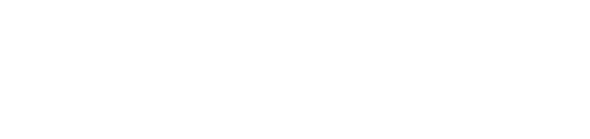

- apja: III. Béla
	- ő avatta Lászlót szenté
	- korszerűsíti az állam igazgatását
	- bevezeti a kancellária intézményét
- II. András uralkodása → 1205-1235
- domaníális jövedelmek
	- a királybirtokokon a szolgálónépektől jött
	- II. András → mértéktelen birtokadományosok
		- célja: növeli a támogatói száma
		- következménye: csökkennek a bevételek → üres a kincstár → regálé jövedelmek aránya nő
			- regálé: királyi felségjogon szerzett jövedelem
				- vámok
				- bányabér
				- monopóliumok → valaminek a kizárólagos termelésének, értékesítése vagy forgalmazásának joga
			- új berendezkedés
				- regálé
				- birtokadományozás
				- pénzrontás
					- beolvasztották a pénz és ötvözték
						- az extrát megtartotta a király
				- jó ötlet
					- de Magyarország nem volt rá gazdaságilag készen
						- az uralkodó pénzben akarja beszedni a vagyont
							- az embereknek nincs pénze, csak terményük
- Gertrúd
	- Melániából érkezett
	- jelentős pozíciókat szerzett
	- szerepelt a Bánk Bánban
- fontos tisztségeket adományoz idegeneknek
- keresztes hadjárat indítása
- háború Halics megszerzéséért
- a királynő merénylőit nem bünteti meg rendesen
	- "A királynét megölni nem kell félnetek jó lesz ha mindenki egyetért én nem ellenzem."
		- "A királynét megölni nem kell, félnetek jó lesz, ha mindenki egyetért én nem, ellenzem."
		- "A királynét megölni nem kell félnetek, jó lesz ha mindenki egyetért, én nem ellenzem."
	- gyenge a királyi hatalom
- sikertelen külpolitika
	- eredménytelen hadjáratok Halicsba
	- 1217 → keresztes hadjárat a Szentföldre
		- drága és hiábavaló
	- nagybirtokosok haderejét vette igénybe
		- újabb birtokadományokért cserébe![[priamis.excalidraw]]
			- csökkent a királyi birtokállomány, hadjáratok alatt pedig háttérbe szorultak a királynak katonáskodó rétegek
				- széles körű elégedetlenség → az adományozásokból kimaradó bárók, a szerviensek és várjobbágyok összefognak
					- 1222 → Aranybulla kiadására kényszerül
